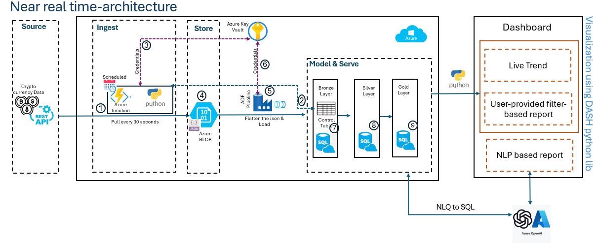
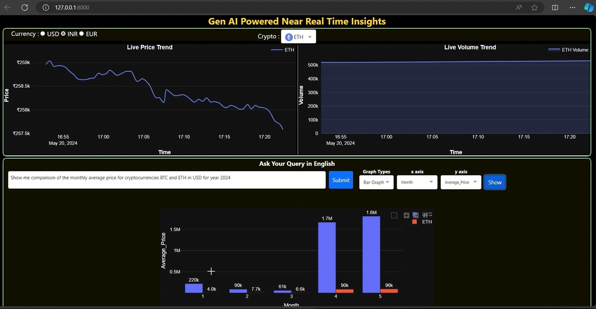

# <center> Gen AI Powered Near Real Time Analytics

### Challenge

The need to monitor business activities as it happens & take actions, has never been greater.

With Near Real Time Analytics demo, we are showcasing how the Crypto currencies performance across
the various currencies can be monitored, analyzed with actionable insights using live trends &
Natural Language Processing (NLP) with Generative AI, in the near real time.

### Solution

- Read data from an external Crypto Currency API every 30 secconds.
- Load Data after processing into the Azure Cloud database.
- Create custom dashboard showing various live trends.
- Gen AI powered NLP based Q&A to get answers.

### Differentiators

- GenAI powered Q&A with summarization & graphs.
- Modular design with ability to connect to various source types.
- Framework can be implemented across different cloud platforms.

### Potential Industry Use cases:

- Inventory Management
- Financial Trading
- Dynamic Pricing
- IoT Devices Monitoring
- Hospital Management

## Near real time-architecture



## Dashboard



## Video Demo

[Watch the demo video](./media/Instant-Intelligence-with-presentation.mp4)

<video controls loop autoplay>
  <source src="./media/Instant-Intelligence-with-presentation.mp4" type="video/mp4">
  Your browser does not support the video tag.
</video>

## STEPS: Project Description

Step 1: Clone the repository

```env
 git clone https://github.com/Shrikanthp04/crypto_dashboard_app.git
```

Step 2: Create and activate a Conda virtual environment

```env
    conda create -n env python=3.11 -y
    conda activate env
```

Step 3: Navigate to the project directory

```env
    cd crypto_dashboard_app
```

Step 4: Install the required packages

```env
    pip install -r requirements.txt
```

### Step 5: Create OpenAI API Key and Database Connection

Before running the project, you need to create an OpenAI API key and set up your database connection. These configurations should be added to a `.env` file in the root directory of your project.

#### Instructions:

1. **Create an OpenAI API Key**:

   - Go to the [OpenAI API Key page](https://platform.openai.com/account/api-keys) and generate a new API key.
   - Copy the generated API key.

2. **Set Up Database Connection**:

   - Ensure you have the necessary database credentials (hostname, username, password, database name, etc.).

3. **Create a `.env` File**:

   - In the root directory of your project, create a file named `.env`.
   - Add the following content to the `.env` file, replacing the placeholder values with your actual credentials:

   ```env
   # OpenAI API Key
    DEPLOYMENT_ENV=your_openai_api_key_deployment_env
    API_KEY=your_openai_api_key
    API_ENDPOINT=your_openai_api_key_endpoint


   # Database Connection
    ODBC_DRIVER=your_database_driver
    DATABASE_SERVER=your_database_server
    DATABASE_NAME=your_database_name
    DATABASE_USERNAME=your_database_username
    DATABASE_PASSWORD=your_database_password
   ```

Step 6: Run the project

    python manage.py runserver
